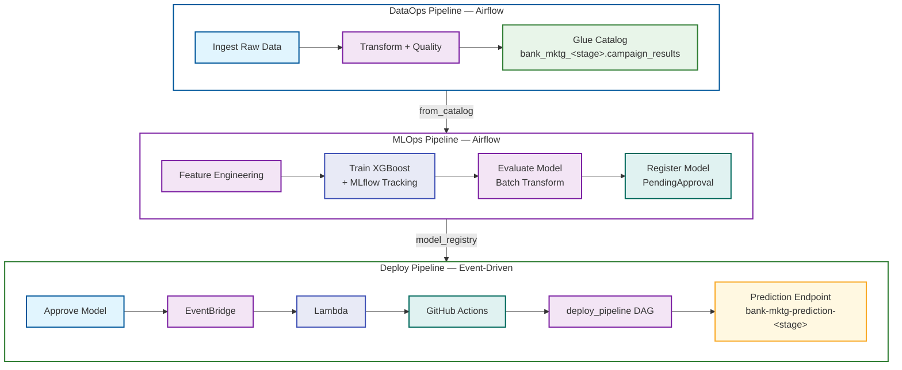

# Unified AI Operations: MLOps and DataOps with SMUS CLI

## Overview

This project provides a framework for deploying end-to-end data and ML pipelines to Amazon SageMaker Unified Studio using the [`aws-smus-cicd-cli`](https://github.com/aws/CICD-for-SageMakerUnifiedStudio). One manifest format. One CLI. One CI/CD pattern — whether you're ingesting raw data with Glue ETL or training an XGBoost model with SageMaker.

It includes two production-ready example pipelines that form a data lineage chain:

- **DataOps** — ingests, transforms, and validates bank marketing data using Glue and Athena
- **MLOps** — trains, evaluates, and deploys an XGBoost binary classifier using SageMaker Airflow operators

Both pipelines follow the same declarative workflow: define resources in YAML, deploy with one command, orchestrate on MWAA Serverless, and promote across environments (dev → test → prod) without code changes.

## Architecture

The system consists of three pipelines that form a data lineage chain with event-driven deployment:



The coupling points:

- **DataOps → MLOps:** Glue Data Catalog. DataOps writes to `bank_mktg_<stage>.campaign_results`, MLOps reads from it.
- **MLOps → Deploy:** SageMaker Model Registry. Training registers models as `PendingManualApproval`, approval triggers deployment via EventBridge → Lambda → GitHub Actions → deploy_pipeline DAG.

Stage-prefixed names (`bank_mktg_dev`, `bank-mktg-prediction-dev`) ensure complete namespace isolation across environments.

### Deployment Flow

```mermaid
flowchart LR
    subgraph Repo[Repository]
        manifest[manifest.yaml]:::input
        workflows[workflows/*.yaml]:::input
        src[src/*.py]:::input
    end

    subgraph CICD[GitHub Actions / Local CLI]
        direction LR
        Describe[describe]:::process
        DeployCLI[deploy]:::process
        RunCLI[run]:::process
        Monitor[monitor]:::process
        Describe --> DeployCLI --> RunCLI --> Monitor
    end

    subgraph AWS[AWS Services]
        S3[Amazon S3]:::success
        Studio[SageMaker Unified Studio]:::info
        MWAA[MWAA Serverless]:::warning
    end

    Repo --> CICD
    CICD --> AWS

    classDef input fill:#e1f5fe,stroke:#01579b,stroke-width:2px
    classDef success fill:#e8f5e9,stroke:#2e7d32,stroke-width:2px
    classDef warning fill:#fff3e0,stroke:#e65100,stroke-width:2px
    classDef process fill:#f3e5f5,stroke:#7b1fa2,stroke-width:2px
    classDef info fill:#e0f2f1,stroke:#00695c,stroke-width:2px

    style Repo fill:transparent,stroke:#01579b,stroke-width:2px
    style CICD fill:transparent,stroke:#7b1fa2,stroke-width:2px
    style AWS fill:transparent,stroke:#2e7d32,stroke-width:2px
```



The SMUS CLI handles resource provisioning in dependency order, stage-specific configuration substitution, and the full deployment lifecycle. GitHub Actions automates this across environments using OIDC authentication with two-hop role assumption (no long-lived credentials).

## Prerequisites

| Tool | Version | Purpose |
| ---- | ------- | ------- |
| Python | 3.11+ | Runtime for CLI and Glue scripts |
| AWS CLI | v2 | AWS resource management |
| `aws-smus-cicd-cli` | latest | Pipeline deployment and orchestration |
| `jq` | any | JSON parsing for shell scripts |

You also need:

- An AWS account with permissions for SageMaker, Glue, Athena, S3, IAM, and MWAA
- A SageMaker Unified Studio domain and project with MWAA Serverless enabled
- Environment variables configured for your target environment

```bash
pip install aws-smus-cicd-cli

export AWS_ACCOUNT_ID=<your-account-id>
export DEV_DOMAIN_NAME=<your-domain-name>
export DEV_REGION=<your-region>
export DEV_PROJECT_NAME=<your-project-name>
export PROJECT_ROLE=<your-login-role-name>
```

For detailed setup instructions (domain creation, IAM roles, connectivity validation), see [Part 2 — Prerequisites](docs/part2-end-to-end-mlops-dataops-example.md#prerequisites).

## Quick Start

```bash
# Deploy and run the DataOps pipeline
cd examples/dataops-pipeline
aws-smus-cicd-cli describe --manifest manifest.yaml --targets dev --connect
aws-smus-cicd-cli deploy --manifest manifest.yaml --targets dev
aws-smus-cicd-cli run --manifest manifest.yaml --targets dev --workflow data_pipeline
aws-smus-cicd-cli monitor --manifest manifest.yaml --targets dev --live
```

## Pipelines

| Pipeline | Directory | Description |
| -------- | --------- | ----------- |
| **DataOps** | [`examples/dataops-pipeline/`](examples/dataops-pipeline/) | Glue ETL + Athena catalog registration |
| **MLOps Training** | [`examples/mlops-pipeline/`](examples/mlops-pipeline/) | Feature engineering, SageMaker training, evaluation, model registry |
| **Deploy (Event-Driven)** | [`examples/mlops-pipeline/workflows/deploy_pipeline.yaml`](examples/mlops-pipeline/workflows/deploy_pipeline.yaml) | EventBridge → Lambda → GitHub Actions → deploy_pipeline DAG → endpoint |

The MLOps pipeline depends on DataOps — run DataOps first to create the `campaign_results` table.

## Infrastructure

| File | Purpose |
| ---- | ------- |
| [`scripts/setup-mlops-infra.sh`](scripts/setup-mlops-infra.sh) | MLflow tracking server + EventBridge deploy trigger + Lambda |
| [`scripts/setup-github-oidc.sh`](scripts/setup-github-oidc.sh) | GitHub OIDC provider + IAM role for CI/CD |
| [`scripts/load_env.py`](scripts/load_env.py) | Load environment config from YAML as exports |

## CI/CD

GitHub Actions workflows for automated multi-account deployment:

| Workflow | File | Purpose |
| -------- | ---- | ------- |
| DataOps | [`.github/workflows/dataops.yml`](.github/workflows/dataops.yml) | Deploy and run data pipeline |
| MLOps | [`.github/workflows/mlops.yml`](.github/workflows/mlops.yml) | Deploy training pipeline + setup MLOps infra |
| Connectivity Test | [`.github/workflows/connectivity-test.yml`](.github/workflows/connectivity-test.yml) | Validate AWS connectivity across environments |

For CI/CD setup (OIDC, GitHub secrets, multi-account topology), see [Part 2 — Automating with GitHub Actions](docs/part2-end-to-end-mlops-dataops-example.md#automating-with-github-actions).

## Documentation

| Document | Description |
| -------- | ----------- |
| [Part 1: SMUS CLI Introduction](docs/part1-aws-smus-cicd-cli-launch-blog.md) | Manifest format, workflow YAML, CLI commands |
| [Part 2: End-to-End Walkthrough](docs/part2-end-to-end-mlops-dataops-example.md) | Prerequisites, pipeline walkthroughs, CI/CD automation |

## Project Structure

```text
├── docs/                              # Blog posts and walkthroughs
│   └── images/                        # Screenshots
├── examples/
│   ├── dataops-pipeline/              # DataOps: Glue ETL + Athena
│   │   ├── manifest.yaml
│   │   ├── workflows/data_pipeline.yaml
│   │   └── src/glue-jobs/*.py
│   └── mlops-pipeline/               # MLOps: SageMaker + MLflow
│       ├── manifest.yaml
│       ├── workflows/training_pipeline.yaml
│       └── src/
│           ├── train_xgboost.py
│           ├── feature_engineering.py
│           └── notebooks/
│               ├── evaluate_model.ipynb
│               └── validate_mlops.ipynb
├── scripts/                           # Setup scripts
│   ├── setup-mlops-infra.sh           # MLflow + EventBridge + Lambda
│   ├── setup-github-oidc.sh           # GitHub OIDC provider + IAM role
│   └── load_env.py                    # Load environment config from YAML
└── .github/workflows/                 # CI/CD pipelines
    ├── dataops.yml
    ├── mlops.yml
    └── connectivity-test.yml
```
